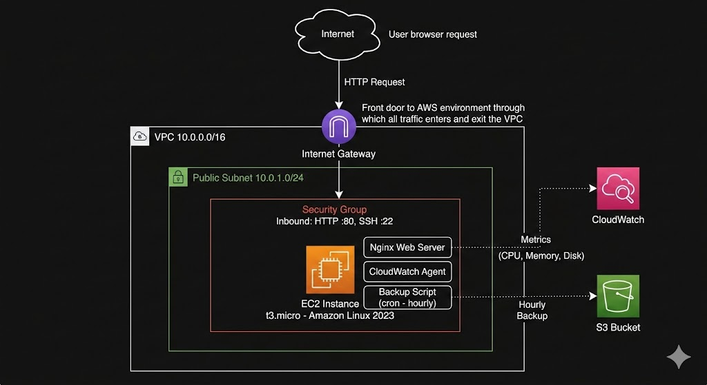

# Cloud Infrastructure Project

A production-like cloud environment built on AWS using Infrastructure as Code (IaC), automated monitoring, and backup automation.

## Architecture



## What This Project Demonstrates

- Infrastructure as Code using Terraform
- AWS networking (VPC, Subnet, Internet Gateway, Route Table, Security Groups)
- Linux server administration (Nginx, user management, file permissions)
- Cloud monitoring with AWS CloudWatch (dashboards, alarms, custom metrics)
- Backup automation using Bash scripting, S3, and cron scheduling
- IAM role and permission management

## Tech Stack

- **Cloud Provider:** AWS
- **IaC:** Terraform
- **Server:** Amazon Linux 2023 on EC2 (t3.micro)
- **Web Server:** Nginx
- **Monitoring:** AWS CloudWatch (CPU, Memory, Disk metrics)
- **Backup Storage:** AWS S3 (versioning enabled)
- **Scripting:** Bash
- **Scheduler:** Cron

## Infrastructure Components

| Resource | Details |
|---|---|
| VPC | 10.0.0.0/16 |
| Public Subnet | 10.0.1.0/24 |
| EC2 Instance | t3.micro, Amazon Linux 2023 |
| Security Group | HTTP (80), SSH (22) |
| S3 Bucket | Versioning enabled, hourly backups |
| CloudWatch | CPU alarm at 70%, memory and disk dashboards |

## Project Structure
```
cloud-infra-project/
├── main.tf           # Core infrastructure definitions
├── variables.tf      # Reusable input variables
├── outputs.tf        # Output values (instance IP, ID)
├── architecture.jpg  # Architecture diagram
└── backup.sh         # Automated backup script
```

## How to Deploy

### Prerequisites
- AWS CLI configured with appropriate IAM permissions
- Terraform installed
- SSH key pair generated at ~/.ssh/cloud-infra-key

### Steps
```bash
# Initialize Terraform
terraform init

# Preview infrastructure changes
terraform plan

# Deploy infrastructure
terraform apply
```

## Monitoring

CloudWatch monitors the following metrics:
- **CPU Utilization** — alarm triggers at 70% threshold
- **Memory Used %** — custom metric via CloudWatch agent
- **Disk Used %** — custom metric via CloudWatch agent

## Backup Method

An automated Bash script runs hourly via cron and:
1. Collects application logs and Nginx logs
2. Captures system info (disk usage, memory, running services)
3. Compresses everything into a timestamped archive
4. Uploads to S3 for durable cloud storage
5. Cleans up local temp files

## Troubleshooting Experience

- Resolved Terraform resource declaration errors through file inspection and targeted fixes
- Debugged CloudWatch missing metrics by inspecting metric dimensions via AWS CLI
- Fixed Bash script permissions issues with Nginx log files
- Resolved EC2 free tier instance type compatibility issues
